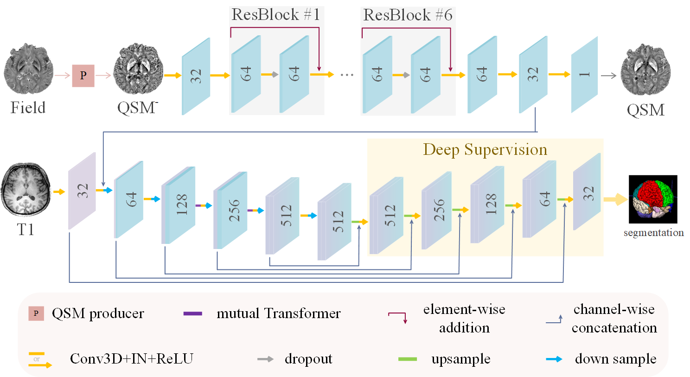

# mQSM: Multitask Learning-based Quantitative Susceptibility Mapping for Iron Analysis in Brain

## Overview
We provide the PyTorch implementation of our MICCAI-2024 submission ["mQSM"](https://doi.org/10.1007/978-3-031-72069-7_31).



## Files description
SaB-Net contains the following folders:


├── src  
&nbsp;&nbsp;&nbsp;&nbsp;&nbsp;&nbsp;&nbsp;&nbsp;&nbsp;&nbsp;├── execution &nbsp;&nbsp;&nbsp;&nbsp;\\ store the running scripts  
&nbsp;&nbsp;&nbsp;&nbsp;&nbsp;&nbsp;&nbsp;&nbsp;&nbsp;&nbsp;├── network &nbsp;&nbsp;&nbsp;&nbsp;\\ store the model  
&nbsp;&nbsp;&nbsp;&nbsp;&nbsp;&nbsp;&nbsp;&nbsp;&nbsp;&nbsp;└── scripts  &nbsp;&nbsp;&nbsp;&nbsp;\\ functional codes  


## Usage

### Install requirements

pip install -r requirements.txt

### Preprocess
```python
python execution/preprocess.py -r [mQSM_raw folder] -p [mQSM_processed folder] -D [dataset_ID] 
```

### Train   
```python
python execution/train.py
```

### Predict
```python
python execution/predict.py
```
